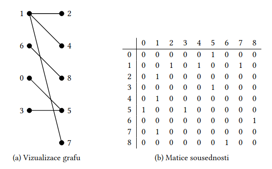

@mainpage

# isBipartite

+ Tento projekt slouží primárně k detekci bipartity grafu. 

Předpokladem je, že graf 𝐺 má 𝑛 vrcholů, které jsou očíslovány 0, 1, … , 𝑛 − 1. Graf 𝐺 je zadán maticí sousednosti, tj. čtvercovou maticí 𝐴 o rozměrech 𝑛 × 𝑛, kde prvek matice je 𝑎𝑖𝑗 = 1, pokud existuje hrana z vrcholu 𝑖 do vrcholu 𝑗, jinak je 𝑎𝑖𝑗 = 0.

Program nejprve vytvoří instanci grafu načteného z matice sousednosti zapsané v testovacím souboru a následně na něm ověřuje bipartitu pomocí vyhledávacího algoritmu (Depth-First Search).

## Jak projekt zkompilovat
Předpokladem je mít nainstalovaný CMake (verze 3.10+) a kompilátor podporující C++17.

1. `mkdir build`
2. `cd build`
3. `cmake ..`
4. `make`